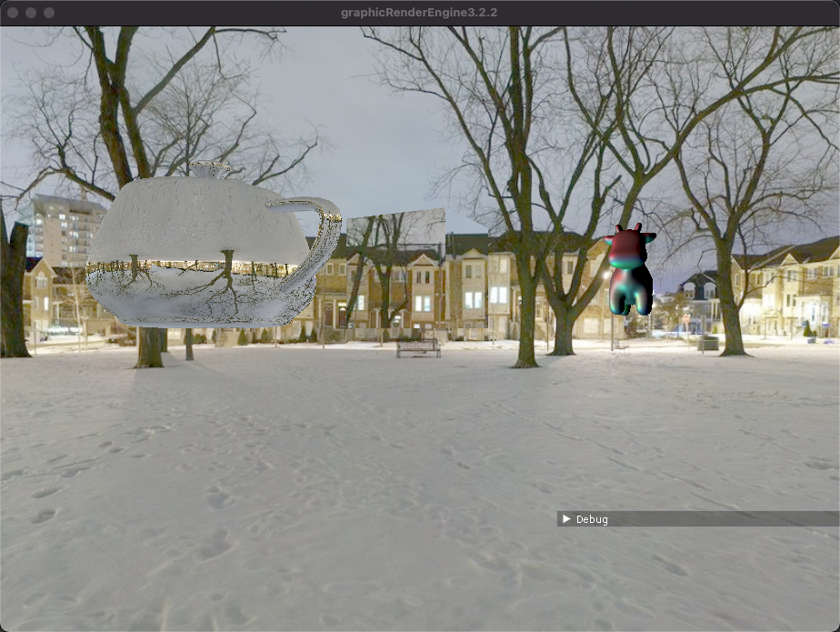
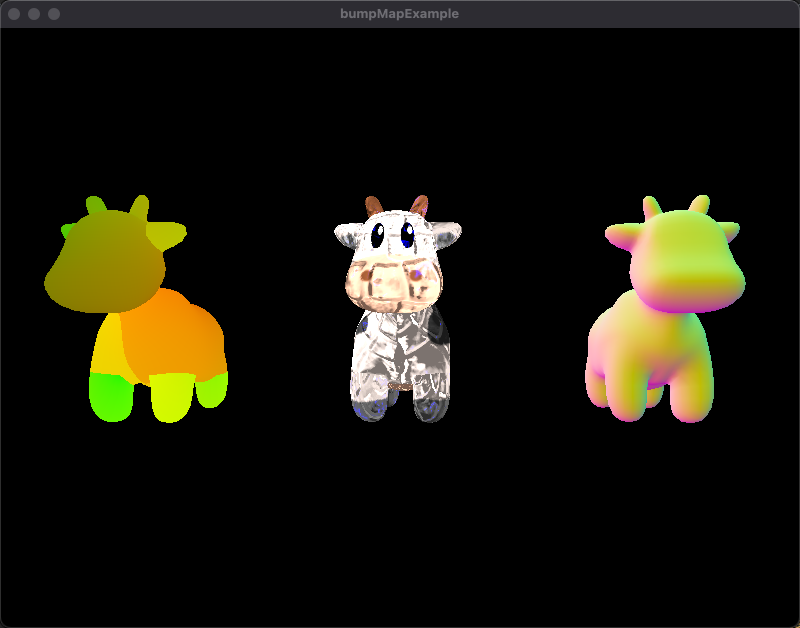

# graphicRenderEngine
This is a simple render engine based on OpenGL in MAC-OS, which use C++17

render engine：ceres

Ceres :dwarf planet and largest asteroid of the main asteroid belt

representative: goddess of agriculture, representing productivity, agriculture, nature and the four seasons

# dependencies
* glfw:a multi-platform library for OpenGL, OpenGL ES, Vulkan, window and input.
* glew:the OpenGL extension wrangler library.
* glm:OpenGL mathematics library.
* spdlog:fast C++ logging library.
* imgui:bloat-free Graphical User interface for C++ with minimal dependencies.
* stb:single-file public domain libraries for C/C++.
* json11:A tiny JSON library for C++11.
* lua:Lua is a powerful, efficient, lightweight, embeddable scripting language.
* sol2:a C++ <-> Lua API wrapper with advanced features and top notch performance.
* box2d:a 2D physics engine for games.
* bullet3: real-time collision detection and multi-physics simulation for VR, games, visual effects, robotics, machine learning etc.

# test demo
* A visual demo of functions that can be updated in real time, which based lua script language.

* A cloth Simulation Test

* skybox Test:cubeMap + AmbientMap(Reflection + Refraction)

* obj loader Test

* ambient map Test

* pbr Test

* point sprites Test

* cubemap Test

* shadowmap Test

* shadow volume Test

* bump map Test

* particleSystem Test

