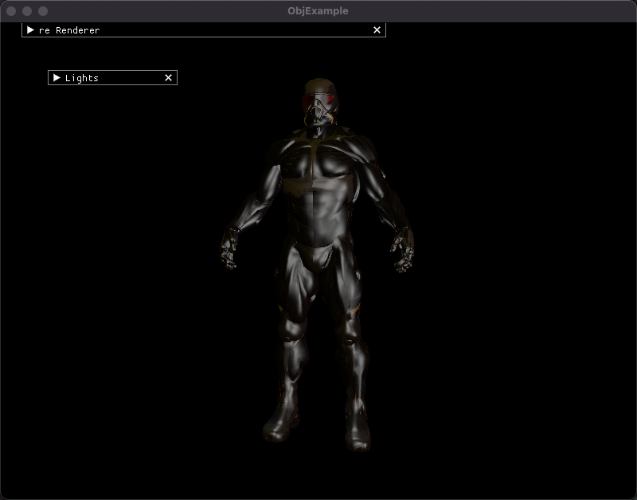
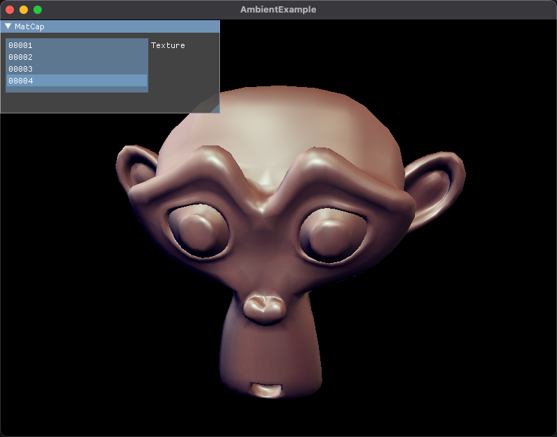

# simpleRenderEngine
这是一个基于C++17标准的，使用OpenGL语言编写的的简单的渲染引擎

# dependencies
* glfw:一个用于 OpenGL、 OpenGL ES、 Vulkan、窗口和输入的多平台库
* glew:OpenGL 扩展管理器库
* glm:OpenGL数学库
* spdlog:一个高效的C++日志库
* imgui：一个无依赖的的C++图形用户界面库
* stb:一个用于C/C++的单文件加载库
* json11:一个基于C++11标准的的小型json库
* lua:Lua是一种强大、高效、轻量级、可嵌入的脚本语言。
* sol2:一个具有高级功能和高性能的C++ <-> Lua API的工具库
* box2d:一个人用于游戏的2D物理引擎
* bullet3:一个适用于 VR、游戏、视觉效果、机器人、机器学习等的实时碰撞检测和多物理场仿真的工具库

# test demo
* 基于lua脚本语言的函数可视化demo

* 布料仿真demo

* 天空和demo

* 模型demo

* 环境贴图demo

