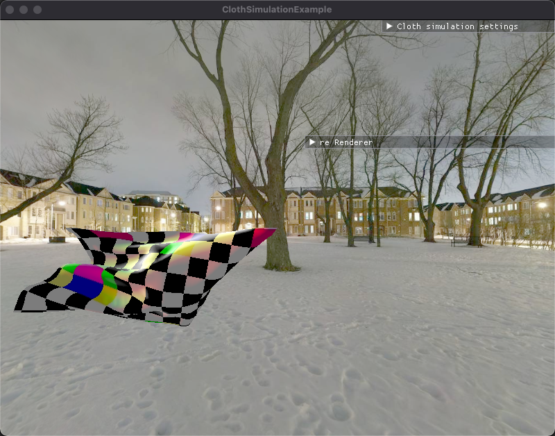
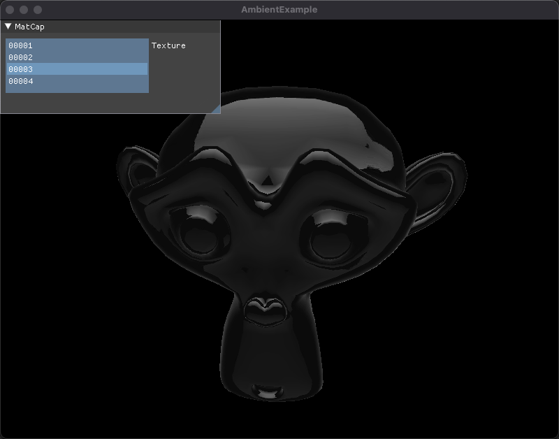
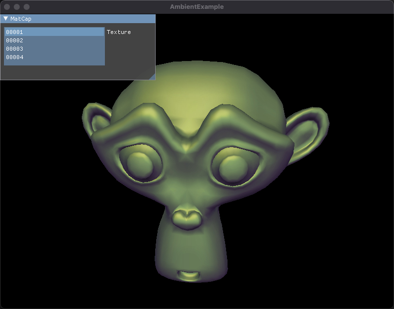
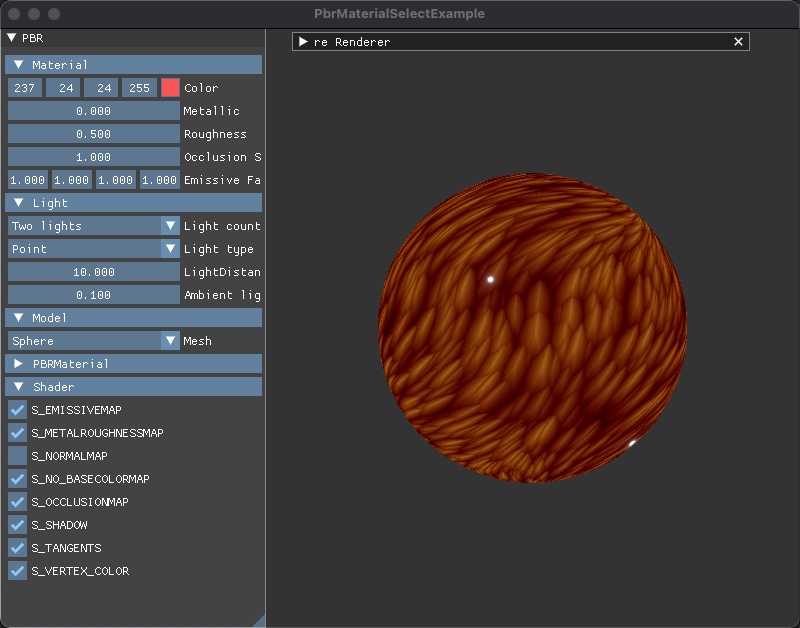
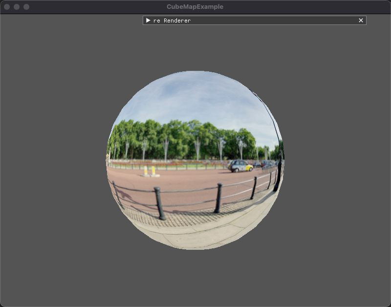
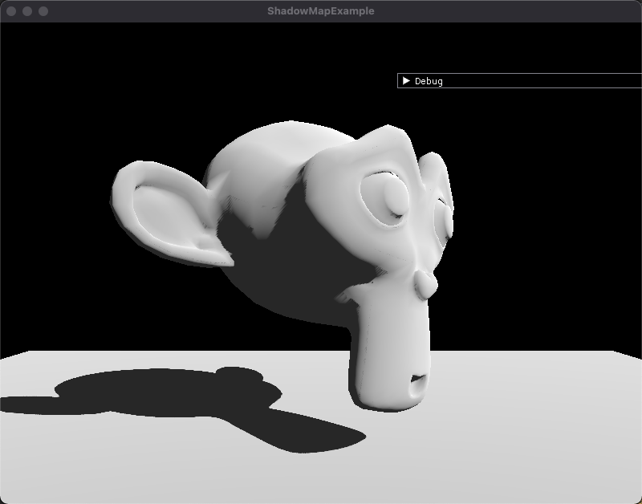
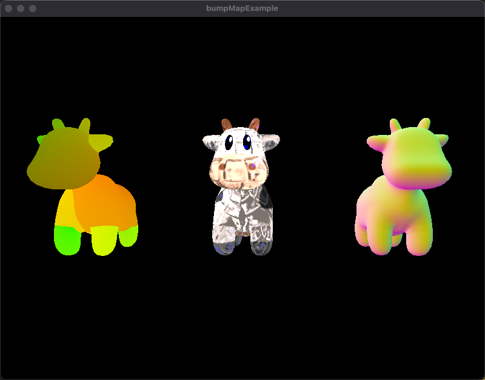
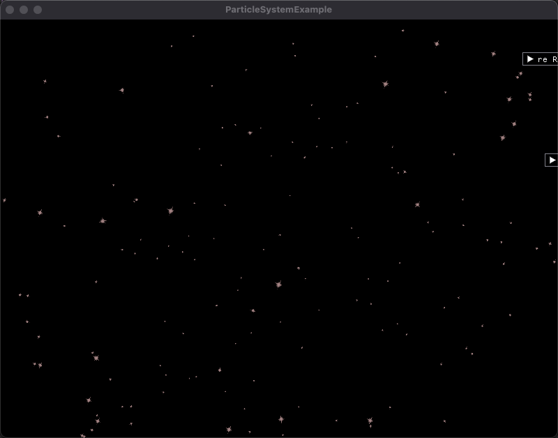

# test demo
* A visual demo of functions that can be updated in real time, which based lua script language.

* A cloth Simulation Test

* skybox Test:cubeMap + AmbientMap(Reflection + Refraction)

* obj loader Test

* ambient map Test

* pbr Test

* point sprites Test

* cubemap Test

* shadowmap Test

* shadow volume Test

* bump map Test

* particleSystem Test

