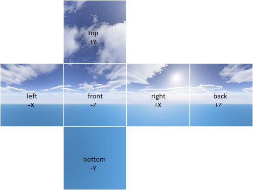

# 立方体贴图

## 关于立方体贴图纹理坐标的计算：
例如:对于给定的矢量(−3.2, 5.1, −8.4)，就选择-Z 面)，而对剩下的两个坐标除以最大绝对值坐标的绝对值， 
即8.4。那么就将剩下的两个坐标的范围转换到了-1 到 1，然后重映射到[0，1]范围，以方便纹理坐标的计算。例如，
坐标(-3.2,5.1)映射到((-3.2 / 8.4 + 1)/ 2，(5.1/ 8.4 + 1)/ 2)≈(0.31,0.80)